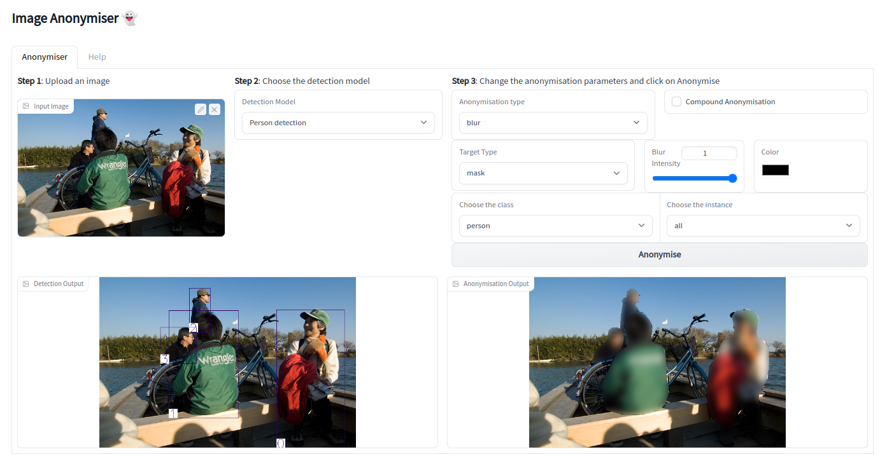
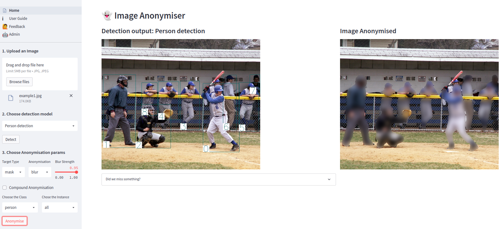
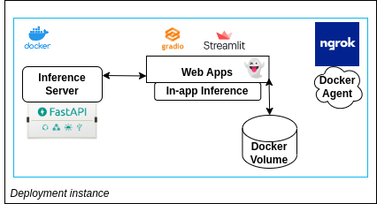

## 👻 Image Anonymiser

Welcome ! this project has been developed as part of the [Full Stack Deep Learning](https://fullstackdeeplearning.com/) course (2022 edition). The aim of the project was to develop an ML-powered web application that allows users to anonymise specific classes of objects in an image (e.g. faces, people, text). This problem is critical in a lot of domains and the applications include preserving privacy, protecting confidential information, removing branding references etc. The work we've done is open source and available in [Github](https://github.com/saadaosa/ImageAnonymiser)

The aim of this document is to present our solution, the steps we took to build it as well as the lessons learnt

#### The Team

First of all, this project has been built by `team_003`:
- 👨‍🔧 Sami: Back-end development, Gradio app, Streamlit app, deployment
- 👨‍🔧 Vlado: Back-end development, Streamlit app, Data flywheel
- 👨‍🔬 Lawrence : Selection of pre-trained models, model training
- 👨 Al : Testing
- 👨 Dan : Testing 

#### Product overview

Our implementation is composed of three main blocks:

##### 1) Web applications

**The first MVP**

- After doing a first research iteration in order to identifiy the tech stack that we would use, we decided to build the first MVP using [gradio](https://gradio.app/), as shown in the following screenshot:

- The gradio app is actually still compatible with the current backend and could be deployed with the same code (more on this later). 
- It allows the user to upload an image, perform object detection or segmentation (based on the model chosen) and anonymise the input depending on user preferences. 
- The customization includes: 
  - choosing between `blur` and `color`, and anonymising the region within the `bounding box` or the `pixels` (depending on the model) by also varying the `blur strength` 
  - anonymising all objects belonging to a given `class` or by `instance`
  - using a `compound` feature to allow the user to anonymise the image based on predictions coming from different models or different classes and instances  

**Switching to [Streamlit](https://streamlit.io/)**

- Our first motivation to explore the possibility of moving away from Gradio, was that we wanted to build the components of a `data flywheel`. Gradio, has a `flag` mechanism but we wanted to find a way to add user annotations 
- We found [streamlit-cropper](https://github.com/turner-anderson/streamlit-cropper), a custom component that we used to add the user annotation feature. This new feature was not just about collecting annotations (which is a decision by the user), but it was a real product feature allowing the user to:
  - Add **custom annotations** for objects that have been missed by the model (based on the classes that the model can detect)
  - **Use these new annotations** to anonymise the custom objects
  - This way it is a **win-win** situation where the user can still anonymise the object of interest that has been missed by the model, and we can collect new annotations (if the user decides to do so)
- Below is a screen shot of the component allowing the user to add custom boxes

- The annotations are saved only if the users click on "send your annotations", and if they decide not to do so, they can still use them for the anonymisation
- If the users decide to send their annotations, these are logged alongside the other model predictions. We developed an **admin interface** where these can be visualised.
- The `admin interface` allows us also to access the feedbacks that the users can send us 

- The Streamlit app offers the same options present in the Gradio one in terms of anonymisation features, but it adds the custom user boxes, the user feedbacks and the admin interface

**Streamlit vs Gradio** (which one to choose as a developer)
First of all, both Streamlit and Gradio are great tools and we didn't have any experience with any of them when we started. So the feedback below is based on the difficulties we encountered as beginners:

<table>
    <tr>
        <th>  </th>
        <th>Reasons to Choose</th>
        <th>Things to be aware of</th>
    </tr>
    <tr>
        <td>Gradio</td>
        <td>
            <ul>
                <li>Super easy to create and deploy your app if you have a simple UI</li>
                <li>Great documentation</li>
                <li>Easy to have a Singleton pattern (e.g. for loading models at startup)</li>
            </ul>
        </td>
        <td>
            <ul>
                <li>The Blocks api that allows you do build more complex apps is relatively new</li>
                <li>It may be difficult to find solutions or examples when you face a problem</li>
            </ul>
        </td>
    </tr>
    <tr>
        <td>Streamlit</td>
        <td>
            <ul>
                <li>UI that looks "professional" out of the box</li>
                <li>Relatively big community so you can find help, custom components etc.</li>
            </ul>
        </td>
        <td>
            <ul>
                <li>The way Streamlit re-executes your script can make it challenging in terms of latency and coding if your UI is complex</li>
                <li>Their new caching mechanisms are still experimental and not always "stable"</li>
            </ul>
        </td>
    </tr>
</table>

**Main lesson learnt**: When using Streamlit or Gradio and you want to build a complex UI, you need to deploy as soon as possible and test how your design impacts latency in a production setting (testing in localhost is a very misleading benchmark!); you may then have to use a more "traditional" javascript framework

##### 2) The backend

The backend consists of three main components:

###### a) The detector:
- Since we have a `multi-model` support in our application, the detector module manages: 
  - `automatic instanciation` of the different models: This is done through a config file that lists the models that should be exposed in the UI as well as their default parameters. This allows us to deactivate/add models with no change/new development in the backend or the frontend, as long as these models are instances of classes that are available in the models module
  - Calling the detection function of the relevant model
  - Sending the relevant `predictions data` required by the Stremlit or Gradio app
  - Identifying the `target regions` in the image that need to be anonymised based on the user input (as a reminder you can anonymise all instances of a class or by instance)
  - `Visualising` output images
  - Adding `new user annotations`, as this impacts most functions above
- Although we could have changed some logic inside the detector, we decided to keep a "backward compatibility" with the initial Gradio app. This allows us to continue testing the gradio setting
- The detector can also be used in **inference API server** mode using [FastAPI](https://fastapi.tiangolo.com/). This is a feature we added late in the process with the aim of making the Stremlit app more light weight and decouple the two services (not just functionnaly but also by having two different servers)    

###### b) The anonymiser:

- Manages all the functionalities related to the anonymisation i.e. blurring functionality (for this we leverage [opencv](https://opencv.org/)), coloring, conversions from user inputs to opencv parameters 

 ###### c) The data persistence module (FileIO)

- Implements all the functionalities needed for:
  - storing/retrieving images flagged/annotated by the user
  - storing retrieving user feedbacks
  - logging

**Main lesson learnt**: When dealing with several deep learning models in your app that may be big in size, decoupling the inference server from your web app (even for an MVP) should be considered from the beggining. In particular, the memory requirements (even if the models are loaded only once), can have a huge impact on latency and functioning of the app 

##### 3) The models

- Our approach to model training has been very pragmatic since day one: Leverage pre-trained models as much as possible especially during the first stages of MVP building

- We identified several alternatives, but then decided to use [Detectron2](https://github.com/facebookresearch/detectron2) for multi-class and person detection and segmentation, [EasyOCR](https://github.com/JaidedAI/EasyOCR) for text detection and [facenet](https://github.com/timesler/facenet-pytorch) for face detection

- We also trained our own face segmentation model by leveraging the Detectron2 framework. The training has been done on [lambdalabs](https://lambdalabs.com/) and the artifacts stored in [Weights and Biases](https://wandb.ai/site) 

- One of the key elements when it comes to managing multiple detection models, was to define a **`common output interface`**. This allowed us to have almost no model specifc logic in the backend, and to add new models with minimal development effort

**Main lesson learnt**: Pre-trained models can be a great way to get you started; however be careful and make sure to understand them especially when it comes to the output they generate, their input/default parameters, the dataset that was used etc.  

#### Deployment

- We containarised our services and provided instructions/scripts that can be found in our [Github repo](https://github.com/saadaosa/ImageAnonymiser)

- Since we had access to the Lambdalabs instance during the course, and given that several models benefited from GPU inference, we decided to deploy the whole stack to Lambdalabs

- The app (both streamlit and gradio) can however be used in `both GPU and CPU mode` (just by switching the config file), so having access to a GPU during inference is not a requirement; and the inference times in CPU mode are still in the single digit/low teen seconds (so still manageable)

- To store data (coming from feedbacks and user annotations), we leverage `Docker volumes` that can be shared between containers

- We included the download of model artifacts in the docker build stage in order to avoid having long downloads during app start-up. The docker entry point is itself a script that allows us to switch between the different app versions and modes 

- Finally to provide https access, we use a [Ngrok](https://ngrok.com/) agent (instruction also available on [Github](https://github.com/saadaosa/ImageAnonymiser))

**Main lesson learnt**: Even if you are still in an early stage and not using managed services, there are simple optimisation tasks that can help massively with deployment including: 
- restructuring your dockerfiles to take advantage of caching and not re-running the whole process from scratch. This is particularly useful when you have libraries like Pytorch and your requirements file doesn't change. In this case make sure that the install of the libs happens before the copy command of your revised app
- Leveraging scripting as much as possible 

#### Conclusion

This has been a very rewarding experience. There are obviously so many things we wish we had more time to do, so many mistakes we should have avoided, but we did learn a lot during this 4 week period and we hope that this write-up can give you some interesting insights if you are at the beginning of your ML-product building journey 👻    

